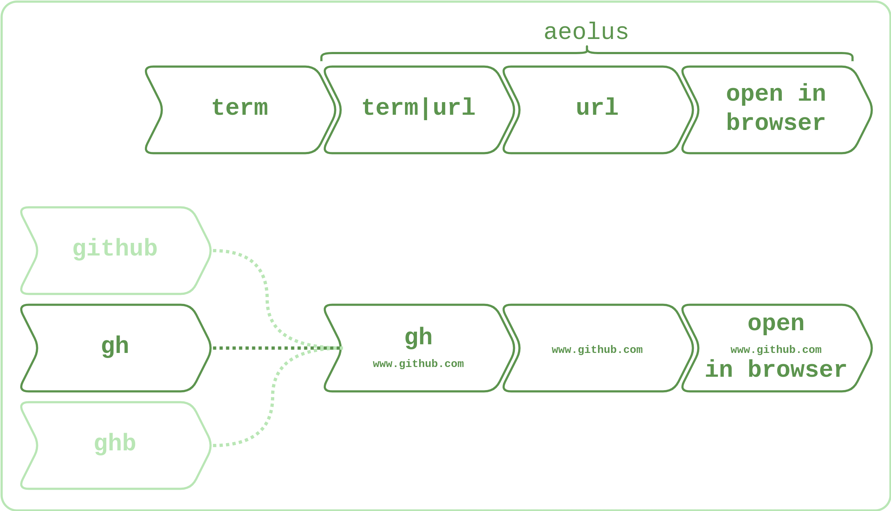

# ***a e o l u s***

```                                                      
                              ,,                      
                            `7MM                      
                              MM                      
 ,6"Yb.   .gP"Ya   ,pW"Wq.    MM  `7MM  `7MM  ,pP"Ybd 
8)   MM  ,M'   Yb 6W'   `Wb   MM    MM    MM  8I   `" 
 ,pm9MM  8M"""""" 8M     M8   MM    MM    MM  `YMMMa. 
8M   MM  YM.    , YA.   ,A9   MM    MM    MM  L.   I8 
`Moo9^Yo. `Mbmmd'  `Ybmd9'  .JMML.  `Mbod"YML.M9mmmP' 
```

This project is a script that takes a term, matches it with a url defined in the json database in the resources folder and takes you to that url so you don't have to remember hundreds of urls.



## Usage

### As a standalone python program

#### To go to a url

```bash
python aeolus.py -m github -g
python aeolus.py --matcher github --go-to
```

#### To print the matched url

```bash
python aeolus.py -m github -p
python aeolus.py --matcher github --print-details
```

#### To add a url+term to match

```bash
python aeolus.py -t github -u www.github.com
python aeolus.py --add-term github --add-url www.github.com
```

### As a *bash* or *zsh* command

There are way more professional ways of doing this but the following instructions offer a beginner friendly way of using the script in **bash** or **zsh** (also works in **git bash**). 

For the script to work you need to make it available in the path. For that, you'll have to edit (or create, in case you have never done this before) a source file for your terminal of choice:

- If you use **bash** or **git bash** the file you'll have to edit/create a file called `.bashrc`
- If you use **zsh** the file you'll have to edit/create a file called `.zshrc`

In both cases, the source file should be at the home directory (type `cd ~` to get to it).

Add the following lines to the file:

```bash
aeolus_path="<path to the directory where you cloned this project>"

function aeolus() {
    pushd . >> /dev/null
    cd $aeolus_path
    python aeolus.py -m $1 -g | tail -n +1 >> /dev/null
    popd >> /dev/null
}

function aeolusa() {
    pushd . >> /dev/null
    cd $aeolus_path
    python aeolus.py $@ | tail -n +1 >> /dev/null
    popd >> /dev/null
}

function aeolusp() {
    pushd . >> /dev/null
    cd $aeolus_path
    python aeolus.py -m $1 -p | tail -n +1 >> /dev/null
    popd >> /dev/null
}
```

#### Usage as **bash** or **zsh** after config explained above is done

##### To go to a url

```bash
aeolus github
```

##### To print the matched url

```bash
aeolusp github
```

##### To add a url+term to match

```bash
aeolusa -t github -u www.github.com
```

### Bulk linking

First, prepare a `.csv` file in the format of the example below:

```csv
<term>,<url you want to link>
<other term>,<other url you want to link>
...
```

For instance:

```csv
stkovf,www.stackoverflow.com
github,www.github.com
...
```

To run the bulk linking, execute the command below in the folder you cloned this project into:

```bash
python bulk_link.py -f <path to the csv file you created in the step above>
```